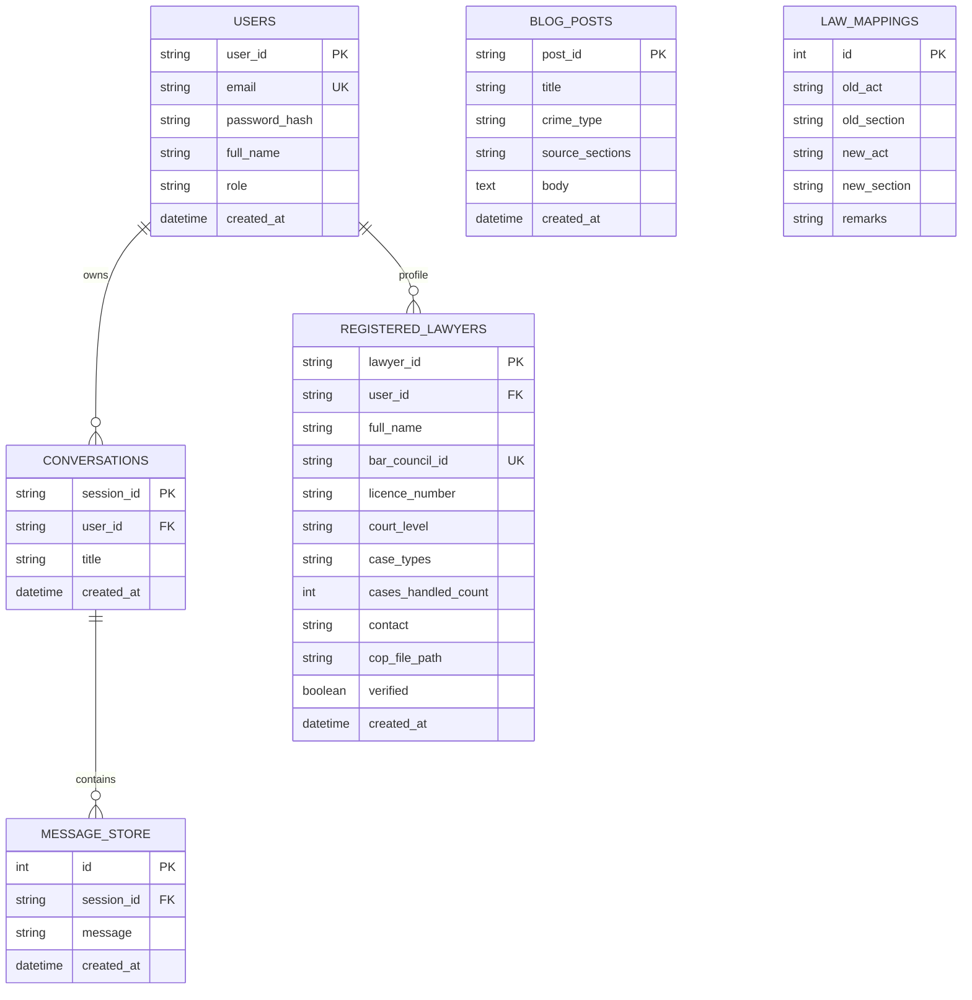

# NyayAssist: Comprehensive Technical Architecture & Project Report
**An AI-Powered Legal Enablement, Statutory Translation, and Court-Ready Document Automation Platform for the Indian Legal System**

---

## 1. Executive Summary & Problem Context

### 1.1 The Challenge in the Indian Legal Landscape
The Indian legal system is undergoing the most monumental statutory overhaul in its post-independence history. In 2023, the Parliament of India replaced the century-old colonial criminal legal framework with three transformative statutes:
1. **The Bharatiya Nyaya Sanhita, 2023 (BNS)** — replacing the *Indian Penal Code, 1860 (IPC)*.
2. **The Bharatiya Nagarik Suraksha Sanhita, 2023 (BNSS)** — replacing the *Code of Criminal Procedure, 1973 (CrPC)*.
3. **The Bharatiya Sakshya Adhiniyam, 2023 (BSA)** — replacing the *Indian Evidence Act, 1872 (IEA)*.

This historic transition created severe friction across the judicial ecosystem:
* **The Lay Citizen's Knowledge Gap**: Common citizens struggle to understand new legal terminologies, cognizable/non-bailable classifications, procedural remedies, or how to register an FIR without procedural rejection.
* **The Advocate's Practice Burden**: Legal practitioners must constantly cross-map old sections to new penal provisions, track limitation periods, draft standardized court documents, and prepare evidence compliance certificates (e.g., Section 63 BSA electronic evidence declarations).
* **Document Automation Bottleneck**: Standard legal drafting (Rental Agreements, Employment Contracts, Non-Disclosure Agreements, Legal Notices) remains manual, prone to errors, and inaccessible to underprivileged litigants.

### 1.2 The NyayAssist Solution
**NyayAssist** is an enterprise-grade, full-stack LegalTech platform that bridges the gap between citizens, advocates, and the statutory framework. It unifies:
* **Retrieval-Augmented Generation (RAG)** over the 2023 Sanhitas and erstwhile codes.
* **Voice-Assisted FIR & Complaint Drafter** with multilingual speech transcription and automatic legal categorization.
* **Court-Ready Document Generator** creating formatted legal documents and downloadable vector-rendered PDFs.
* **Smart Contract & Agreement Risk Analyzer** performing automated risk scoring, clause extraction, and loophole detection via Optical Character Recognition (OCR).
* **Verified Lawyer Directory with 1-Click AI Pre-Consultation Dossier Engine**.
* **Interactive Legal Blog & Law Mapper** equipped with an adjacent contextual AI Assistant.

---

## 2. High-Level System Architecture

```mermaid
graph TD
    subgraph Frontend_Client [Vite + React 18 + TypeScript + TailwindCSS]
        UI_Home[Landing & Hero Hub]
        UI_Chat[Legal Chat & Voice FIR Assistant]
        UI_DocGen[Document Studio & PDF Generator]
        UI_Contract[Contract Risk Analyzer & OCR]
        UI_Directory[Lawyer Directory & AI Dossier]
        UI_Portal[Advocate Portal & Verification]
        UI_Blog[Legal Blog & Adjacent AI Assistant]
        UI_Admin[Admin Verification Console]
    end

    subgraph Backend_Gateway [FastAPI High-Performance Async Gateway]
        Router_Auth[/api/auth - JWT & RBAC]
        Router_Chat[/api/chat - RAG & SSE Streaming]
        Router_DocGen[/api/document-generator - Pleading Automation]
        Router_Contract[/api/contract-analyzer - OCR & Risk Scoring]
        Router_Lawyers[/api/lawyers & /api/lawyer-portal]
        Router_Blog[/api/blog - Search & Adjacent QA]
        Router_Admin[/api/admin - Verification Management]
    end

    subgraph AI_Intelligence_Tier [Unified LLM & Embedding Pipeline]
        LLM_Groq[Groq LPU Engine - LLaMA 3.3 / Qwen / GPT-OSS]
        LLM_Gemini[Google Gemini 2.0 / Flash API Fallback]
        LLM_Ollama[Ollama Local Offline LLM Fallback]
        FAISS_Engine[FAISS Vector Store - sentence-transformers/all-mpnet-base-v2]
    end

    subgraph Data_Storage_Layer [Embedded Persistence]
        SQLite_DB[(SQLite DB - nyayassist.db via SQLAlchemy)]
        Vector_Index[(FAISS Binary Vector Index - faiss_index/)]
        Uploads_Dir[Verification Uploads & Generated Docs]
    end

    Frontend_Client <-->|REST API & SSE EventStreams| Backend_Gateway
    Backend_Gateway <-->|LangChain Orchestration| AI_Intelligence_Tier
    Backend_Gateway <-->|SQLAlchemy ORM & File IO| Data_Storage_Layer
```

---

## 3. Technology Stack & Library Matrix

| Layer | Technology / Library | Version / Detail | Purpose & Rationale |
| :--- | :--- | :--- | :--- |
| **Frontend Framework** | React + Vite | React 18 / Vite 8.2 | Lightning-fast HMR, component modularity, and optimized production bundle. |
| **Language** | TypeScript | v5.x | Strict compile-time type safety across API payloads, state objects, and UI props. |
| **Styling & UI** | TailwindCSS + Lucide Icons | v3.4 | Curated legal color tokens (Navy `#0f172a`, Gold `#d97706`, Slate), rich glassmorphic cards. |
| **PDF Generation** | `html2pdf.js` / native HTML-print | Canvas & CSS Page-Break | High-fidelity vector PDF generation eliminating scrollbar clipping and screenshot blur. |
| **Backend Framework**| FastAPI (Python) | 0.111.0 | Asynchronous REST API, high throughput, automated OpenAPI schema validation via Pydantic. |
| **ASGI Web Server** | Uvicorn | 0.30.1 | High-performance ASGI runtime with reload capability and multi-worker deployment. |
| **ORM & Database** | SQLAlchemy + SQLite | 2.0.31 | Zero-configuration relational persistence (`nyayassist.db`) storing users, sessions, lawyers, blogs. |
| **Vector Search** | FAISS CPU | 1.8.0.post1 | High-speed dense vector similarity search running in-memory with NumPy 1.x compatibility. |
| **Embeddings** | HuggingFace Embeddings | `all-mpnet-base-v2` | State-of-the-art 768-dimensional semantic embeddings for Indian statutory penal codes. |
| **Primary LLM** | Groq Cloud LPU | LLaMA 3.3 70B / Qwen 27B | Sub-second inference (~300 tokens/sec) providing instant legal chat streaming. |
| **Fallback LLM** | Google Gemini API | Gemini 2.0 Flash | Cloud fallback ensuring 100% uptime if primary API encounters network rate limits. |
| **Local Offline LLM**| Ollama | `qwen2.5:7b` | On-premises local LLM execution ensuring privacy and offline capability. |
| **OCR Processing** | PyTesseract + PDFPlumber | 0.3.10 / 0.11.2 | Multi-format text and scanned image extraction from contracts and FIR PDFs. |

---

## 4. Module-by-Module Technical Deep Dive

### 4.1 Legal Consultation Chat & Voice FIR Assistant (`/chat`)
* **Endpoint**: `POST /api/chat/message` (Server-Sent Events streaming), `POST /api/chat/transcribe`, `POST /api/chat/draft-fir`.
* **Technical Nuance**:
  * **Structured Citizen Intake**: Supports both free-form conversational queries and a 5-point structured legal intake (*Incident, Location, Actions Taken, Authority Response, Desired Relief*).
  * **Retrieval-Augmented Generation (RAG)**: The user's query is converted to vector embeddings via `all-mpnet-base-v2`. FAISS retrieves the top $k=5$ most relevant statutory chunks from the BNS, BNSS, and BSA corpus.
  * **Voice FIR Assistant**: Integrates Web Audio API microphone recording with backend transcription. Converts raw spoken complaints into a formal, court-admissible First Information Report (FIR) under Section 173 BNSS (erstwhile Section 154 CrPC) with formal legal headings, complainant details, and prayer.
  * **SSE Streaming**: Uses `StreamingResponse(media_type="text/event-stream")` to stream real-time tokens to the frontend with zero perceived latency.

### 4.2 Automated Legal Document Studio (`/document-generator`)
* **Endpoint**: `POST /api/document-generator/generate`, `GET /api/document-generator/templates`.
* **Technical Nuance**:
  * **Template Library**: Covers 12+ standard Indian legal documents: *Residential Rental Agreement, Non-Disclosure Agreement (NDA), Employment Contract, Freelance/Service Contract, Legal Notice for Debt Recovery, Consumer Complaint, Bail Undertaking, General Power of Attorney*.
  * **Dynamic Form Schemas**: Each template defines customizable input fields, validation rules, stamp duty notices, and jurisdiction-specific clauses.
  * **Multi-Page Printable PDF Engine**: Implements clean CSS `@media print` and `html2pdf.js` page-break controls (`html2pdf__page-break`, `avoid-break-inside`) ensuring that downloaded documents render as true text PDFs with custom watermarks, signature blocks, and legal borders without screenshot clipping or unwanted scrollbars.

### 4.3 Smart Contract & Agreement Risk Analyzer (`/contract-analyzer`)
* **Endpoint**: `POST /api/contract-analyzer/analyze`.
* **Technical Nuance**:
  * **Multi-Format Ingestion**: Ingests `.pdf`, `.docx`, `.txt`, and scanned images (`.png`, `.jpg`).
  * **OCR Pipeline**: Uses `pdfplumber` for digital PDFs and `pytesseract` for scanned document image OCR.
  * **Automated Risk Scoring & Clause Audit**: Evaluates the contract across 6 statutory risk dimensions:
    1. *Indemnity & Liability Caps*
    2. *Termination for Convenience & Lock-in Periods*
    3. *Jurisdiction, Governing Law & Arbitration Seat*
    4. *Non-Compete & Restraint of Trade (Section 27 Indian Contract Act)*
    5. *Intellectual Property Assignment*
    6. *Payment Default & Interest Penalties*
  * **Interactive Redlining**: Highlights ambiguous clauses in Red (Critical), Amber (Moderate), and Green (Standard), accompanied by actionable counter-drafting suggestions.

### 4.4 Lawyer Directory & AI Pre-Consultation Dossier (`/lawyers`)
* **Endpoint**: `GET /api/lawyers`, `POST /api/lawyers/generate-brief`.
* **Technical Nuance**:
  * **Verified Advocate Directory**: Lists advocates filtered by Court Jurisdiction (*Supreme Court, High Courts, District & Sessions Courts*), Practice Areas (*Criminal, Civil, Corporate, Cyber, Family*), Experience, and Bar Council ID verification.
  * **AI Case Brief & Strategy Dossier Generator**:
    * Before a client contacts a lawyer, a 1-click engine processes the client's case narrative.
    * Generates a structured, 4-part **Client Dossier**:
      1. *Case Summary & Chronology of Events*
      2. *Applicable Statutes, Penal Sections & Legal Remedies*
      3. *Checklist of Evidence & Documents to Bring to Consultation*
      4. *Key Strategic Questions to Ask the Advocate*
    * Includes interactive **Download as PDF** and **Clickable Direct Email (`mailto:`)** capabilities.

### 4.5 Advocate Portal & Bar Council Verification (`/lawyer-portal` & `/admin`)
* **Endpoint**: `POST /api/lawyer-portal/register`, `GET /api/lawyer-portal/pending`, `POST /api/lawyer-portal/{id}/verify`.
* **Technical Nuance**:
  * **Certificate of Practice (COP) Upload**: Advocates register with their Bar Council Enrollment Number, primary court level, case experience count, and upload their Certificate of Practice document.
  * **Role-Based Admin Verification**: Applications are routed to the **Admin Dashboard** (`/admin`), where administrators inspect credentials and verify the advocate, immediately reflecting the "Verified BCI Counsel" badge across the public directory.

### 4.6 Legal Blog, Law Mapper & Adjacent AI Assistant (`/blog`)
* **Endpoint**: `GET /api/blog/search`, `GET /api/blog/posts/{id}`, `POST /api/blog/ask`.
* **Technical Nuance**:
  * **Statutory Transition Law Mapper**: Search engine that maps any old IPC/CrPC/IEA section to its new BNS/BNSS/BSA counterpart with remarks on punishment modifications, cognizable status, and procedural safeguards.
  * **Responsive 2-Column Reader Layout**: Left column renders the full article with custom typography; right column houses a sticky **Adjacent AI Article Assistant**.
  * **Contextual Article Q&A**: The adjacent chatbot is injected with the specific article's title, crime type, and statutory text, allowing users to ask follow-up questions regarding bail, penalties, evidence requirements, or scenario applicability.
  * **Smart Markdown & Table Parser**: Parses complex LLM outputs into clean typography, converting markdown table rows into styled HTML data tables, formatting bold/italic emphasis, and stripping ugly raw syntax symbols.

---

## 5. Database Schema & Data Models



---

## 6. AI Orchestration, Prompt Engineering & Reliability Architecture

### 6.1 Multi-Tiered Failover Strategy
To ensure 100% platform availability during high-traffic demonstrations and production deployments:
1. **Tier 1 (Groq Cloud LPU)**: Executes on fast open-source models (`openai/gpt-oss-20b`, `qwen/qwen3.8-27b`, `groq/compound-mini`) with `request_timeout=30s` and `max_retries=3`.
2. **Tier 2 (Google Gemini Flash API)**: Automatically probed and triggered if Tier 1 encounters rate limits or upstream connection timeouts.
3. **Tier 3 (Local Ollama Instance)**: On-premises offline fallback (`qwen2.5:7b`) for complete data sovereignty and air-gapped environments.

### 6.2 Prompt Engineering Principles
* **Plain-Language Constraint**: Instructs the LLM to translate complex legal Latin terms (*mens rea, actus reus, locus standi, suo motu*) into everyday analogies.
* **Statutory Precision**: Strict grounding requiring citation of specific Sanhita sections (e.g., *Section 103 BNS for Murder*, *Section 304 BNS for Snatching*, *Section 482 BNSS for Anticipatory Bail*).
* **Zero Hallucination Grounding**: If statutory provisions do not apply to an unusual scenario, the system explicitly advises consultation with a verified advocate.

---

## 7. Critical Engineering Fixes & Problem-Solving Highlights

During the development lifecycle, several mission-critical technical challenges were identified and engineered to production standards:

1. **NumPy 2.x & FAISS Vectorstore Binary Incompatibility**:
   * *Issue*: Python 3.12 automatically pulled NumPy 2.5.3, causing a low-level C-extension `ImportError` inside `faiss-cpu` (compiled against NumPy 1.x), resulting in search index load failure.
   * *Resolution*: Pinned `numpy<2.0.0` (`numpy==1.26.4`), recompiled vectorstore loader, and implemented graceful statutory fallback so the chat never halts even during index rebuilds.

2. **Full-Fidelity Vector PDF Generation**:
   * *Issue*: Standard canvas-capture libraries produced blurry screenshots and cut off multi-page documents midway with visible browser scrollbars.
   * *Resolution*: Built a custom multi-page PDF rendering pipeline utilizing CSS print page-breaks (`break-inside: avoid; page-break-after: always;`), dynamic watermarking, and clean DOM isolation.

3. **Stream Disconnection & Socket Exception Handling**:
   * *Issue*: Mid-flight stream cancellations produced unhandled `socket.send()` broken-pipe exceptions in Uvicorn.
   * *Resolution*: Refactored `generate()` generator with defensive `try/except/finally` teardown, parameterizing LangChain `PromptTemplate` input variables (`context`, `question`) for clean stream termination.

4. **Raw Markdown & Table Rendering in Chatbots**:
   * *Issue*: LLMs emitted raw pipe characters (`|---|---|`), leading to broken ASCII tables in compact chat bubbles.
   * *Resolution*: Engineered a frontend AST-like line parser converting markdown tables into responsive HTML table components with styled headers, custom badges, and copy-to-clipboard functionality.

---

## 8. Installation, Local Execution & Environment Setup

### 8.1 Prerequisites
* Python 3.10 to 3.12
* Node.js v18+ & npm
* Git

### 8.2 Environment Variables (`.env`)
```env
# Server & Security
SECRET_KEY=nyayassist_super_secure_jwt_secret_key_2026
ALGORITHM=HS256
ACCESS_TOKEN_EXPIRE_MINUTES=1440
NYAYASSIST_ADMIN_PWD=admin123

# Primary AI Provider (Groq Cloud - Free Key from console.groq.com)
GROQ_API_KEY=gsk_your_groq_api_key_here

# Secondary AI Provider (Google Gemini - Free Key from aistudio.google.com)
GEMINI_API_KEY=AIzaSy_your_gemini_key_here
```

### 8.3 Quick-Start Commands
```bash
# 1. Clone repository
git clone https://github.com/YOUR_USERNAME/nyay-assist.git
cd nyay-assist

# 2. Setup Python Virtual Environment & Install Backend Dependencies
python -m venv venv
# Windows:
venv\Scripts\activate
# Linux/Mac:
source venv/bin/activate

pip install -r backend/requirements.txt

# 3. Setup Frontend Dependencies & Build
cd frontend
npm install
npm run build
cd ..

# 4. Generate Legal Embeddings Corpus
python backend/modules/legal_chat/build_corpus.py

# 5. Start Backend Server (FastAPI on Port 8000)
python run.py

# 6. Start Frontend Development Server (Port 5173)
cd frontend
npm run dev
```

---

## 9. Conclusion & Presentation Highlights

**NyayAssist** demonstrates how modern Artificial Intelligence, dense vector embeddings (RAG), and intuitive user-centric design can revolutionize access to justice in India. By demystifying the **Bharatiya Nyaya Sanhita (BNS)**, **BNSS**, and **BSA 2023**, NyayAssist empowers both the common citizen with legal awareness and the practicing advocate with unprecedented drafting and research speed.
